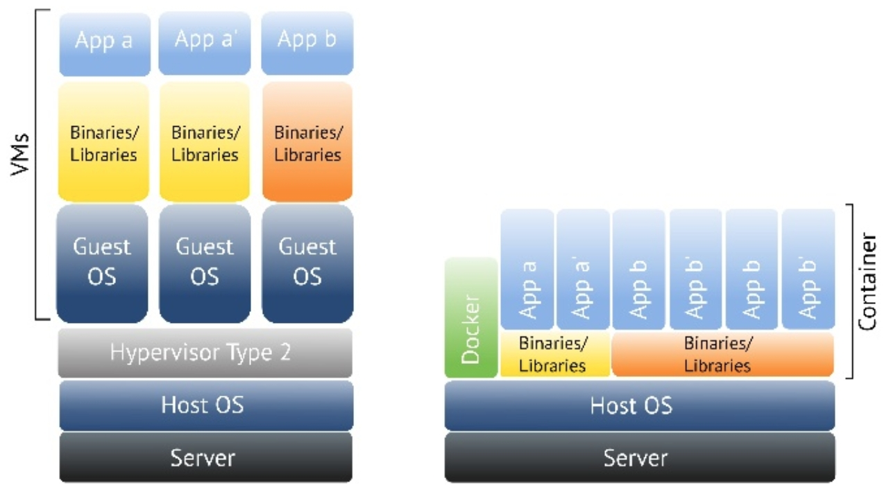
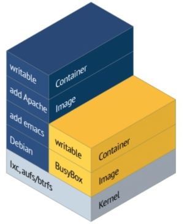

# Docker Introduction

The Basics

---

## What is Docker?

### Container Virtualization

- Container run in user space and use kernel of host
- Has been existing in Linux for quite a while
- Docker builds on Linux Containers (LXC) and makes it easy to use and consume
- Open Source project
- Engine to standarize process environments in Linux
- *"build, ship and run distribruted applications"*
- For DevOps, developers und SysAdmins
- Simplified creation and share (Docker Hub) of container *images*
- **NOT** a virtual server! (less overhead)

---

### Properties

- Allows automatic deployment of a standartized linux environment
- Everything that "runs" on linux runs on docker
- All needed functionality is within the container:
  - libraries
  - dependencies
  - binaries
- container rely on the architecture of the host!

---

### Advantages

- small
- faster
- "secure"
- flexible
- reproducible
- portable

---

### Difference VM vs. Container



- **VM:** Complete "machine" incl. kernel virtualized by a hypervisors.
- **Container:** only processes are virtualized, OS and binaries/libraries are shared.

---

### Images, Container and Registries

- **Docker Images**
  - read only template
  - base for container
- **Docker Container**
  - created / generated based on an image and a dockerfileerzeugt
  - run time changes can be stored in an read/write layer
  - changes can be transfered to a new image ("commit")
- **Docker Regisitries**
  - image repository
  - private or publick
  - e.g. [Docker Hub](https://hub.docker.com/)

---

### Storage, Images und Container



- Everything is based on layers
- except for the topmost layer everything is just read-only
- layers incorporate the changes and diffs
- starts with a base image, where the container is put on top

---

### Dockerfile - Basics

- Manual for an image
- Contains the instructions to create an image
- Instructions are one-liners, starting with a key word
- Instructions are *not* case-sensitive (but keywords are normally upper-case)
- Comments start with a hash (`#`)

---

### Dockerfile  - Example

Example dockerfile for mySQL-server:

```bash
FROM debian:latest
MAINTAINER Batman <batman@gotham.dc>
RUN apt install -y mysql mysql-server
ADD start.sh /start
RUN chmod +x /start
EXPOSE 3306
CMD ["/start"]
```

Note:

add explanations

---

### Docker CLI Commands <small>Part 1</small>

> @todo

see [Cheat-Sheet](./cheat-sheets/docker-commands-cheat-sheet.pdf)

---

### Docker CLI Commands <small>Part 2</small>

| Useful Command                                               | Info                                                         |
| ------------------------------------------------------------ | ------------------------------------------------------------ |
| `docker pull <image_name_or_id>`                             | Download an image, and all its parents.                      |
| `docker run -ti --name <container_name> <image_name> /command` | Run a shell command inside a freshly created and started container. |
| `docker start <container_name>`                              | Start container.                                             |
| `docker stop <container_name>`                               | Stop container.                                              |
| `docker run --rm -ti <image_name> /command`                  | Run a command inside a container from the image and remove container when done. |
| `docker exec -ti <container_name> "cmd"`                     | Run a shell command within a container.                      |
| `docker logs -ft <container_name>`                           | Show/follow log output of the container.                     |
| `docker kill $(docker ps -q)`                                | Kill all runnning docker containers.                         |
| `docker rmi $(docker images -q -f dangling=true)`            | Delete dangling Docker images.                               |
| `docker rm $(docker ps -a -q)`                               | Remove all stopped containers.                               |

---

### Docker Volumes

> @todo

- persistent data
- explicit volumes
- or add subdirectories

---

### Docker Network

> @todo

- By default, three networks
  - none, host, bridge (default)
  - Additional networks can be created
- Bridge network = single host
- Overlay network (advanced topic) can include multiple hosts
- Docker daemon contains embedded DNS server

```bash
# List all networks
docker network ls

# Inspect network details
docker network inspect bridge

# Disconnect a container from network
docker network disconnect bridge mycontainer

# Connect a container to a network
docker network connect mynetwork mycontainer

# Create own network
docker network create -d bridge mynetwork

# Start container in a specific network
docker run -it --net=mynetwork ubuntu
```

---

## Exercise and Further Readings

### Exercise

- Official docker tutorial: [Docker - Get Started](https://docs.docker.com/get-started/)

### Further Readings

- Good Introduction (but a bit dated):
  - [Docker presentation](http://theodorosploumis.github.io/docker-presentation/#/)
  - and [Presentation @ Docker Hub](https://hub.docker.com/r/tplcom/docker-presentation)
- [Docker CheatSheet](https://www.jrebel.com/blog/docker-commands-cheat-sheet)
